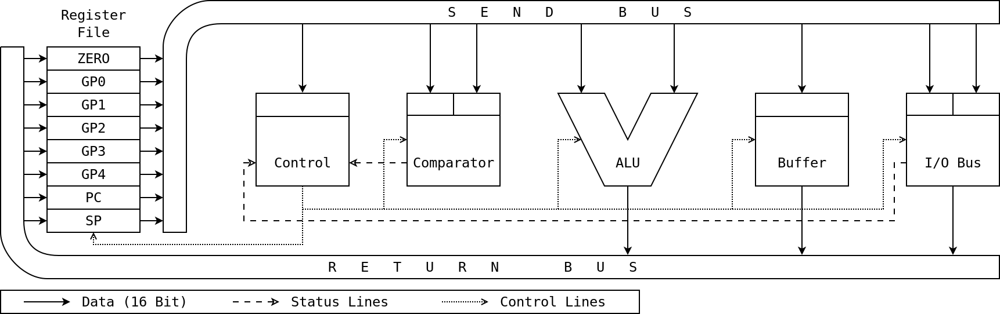

# Digital Electronics Projects

# Table of Contents

1.  [Overview](#org1a573a4)
2.  [16 Bit Processor Design](#orgfbf6110)
    1.  [Project Goals](#org7253817)
    2.  [Design](#org3df4488)
        1.  [Bus Interface](#org5e83226)
        2.  [Arithmetic Logic Unit](#org949566b)
        3.  [Register File](#org9582245)
        4.  [Comparator](#orgdb2ae5e)
        5.  [Buffer](#org16c6a65)
        6.  [Control Unit](#org8a7800a)
    3.  [Implementation](#orgce77af2)
    4.  [Further Development](#org23b4af3)
        1.  [Improvements](#org2527874)
        2.  [Issues](#org01febd6)
3.  [MC6802 System Design](#orgc2fa4e1)
    1.  [Project Goals](#orge905517)
    2.  [Design](#orgbe99439)
    3.  [Implementation](#orgdf3097c)

# Overview

This repository contains work I did in my digital electronics classes,
all of which falls under processor design. My first major project in
this realm was unique, and I specified it myself. I chose to attempt
the design of a sixteen bit processor, using an all new architecture,
constructed exclusively out of discrete 74LS series logic chips and
various other components. I split the project into six distinct parts,
and my group constructed between one and two thirds of the processor.

My other processor project used a component which already existed: the
MC6802 eight bit processor from Motorola. The goal was to design a
complete computer around this processor, including memory, devices
(including an analog to digital converter for signal input), and
interrupts. Then, we were to write programs in machine code for the
processor, and demonstrate various algorithms, including multiply,
divide, and basic audio processing.

# 16 Bit Processor Design

Most of this top level directory is devoted to my processor design
project. The file `engnotes.pdf` contains the engineering notes I
wrote while I was actively working on this project; they provide a
high level overview of the architecture I came up with. Three images
of the constructed bus interface are also present; unfortunately they
were taken after many of the orange data wires were cannibalized for
other projects. The `diagrams` directory holds the digital diagrams I
created to work out the architecture; these were supplemented by many
pencil sketches and diagrams. The `schematics` directory contains full
schematics of the parts which made it to a final design phase, and my
Kicad project folder.

## Project Goals

-   Understand how digital logic is constructed by combining regular
    analog components
-   Grasp why binary is the best system for digital, as opposed to
    decimal levels or some other scheme
-   Examine and create digital logic at the level of individual gates
    and single bits of memory
-   Draw pictures of digital systems; diagram their inputs, outputs, and
    states; and use schematic capture programs
-   Appreciate the physical limitations on digital circuitry, including
    current, heating, and propagation time
-   Work with counters, registers, multiplexers, and more: understand
    their function and when to use each
-   Read datasheets describing digital logic components and use all
    information so gleaned
-   Design a general purpose processor from scratch and construct it
    using only basic logic chips
-   Practice wiring large circuits by hand to get a feel for what an
    implemented design really is
-   Construct a complete processor and demonstrate it running code to
    complete some task

## Design

Six distinct components comprise my processor architecture, which uses
a sixteen bit word.

The bus interface connects the internal world of the processor to the
external world of devices, including memory, storage, user input, and
output.

An arithmetic logic unit performs basic operations on data,
including addition and subtraction; these can be combined to execute
any computable algorithm, making this the core of the processor.

The register file provides space to store the data words the processor
is actively working with at any time, as well as a counter to track
the current memory address and a stack pointer to aid subroutine
execution.

A comparator can quickly determine whether a value is less than, equal
to, or greater than another; this is useful for execution flow,
including conditional jumps.

My processor uses two separate internal buses, and a buffer allows
data to be passed directly between them whenever needed.

Finally, the control unit reads instructions and orchestrates the
function of every other part of the processor to ensure that the
programs provided by a user are executed without error.

### Bus Interface

The input and output system is first on this list because it is one of
only two components that have been fully constructed and tested, and
was my responsibility. An external interface is an essential part of a
processor, as there must be some means of bringing data into the
system to be processed, and of sending processed data back out into
the world. The bus model is a simple and commonly used method for
exchanging data in complex digital systems, whereby several subsystems
share the same set of digital lines. At any given time, exactly one
device may drive data onto the bus. Any number of devices may listen
for data as long as the driver has adequate current capability.

**Design**

In my processor design, there are two buses internal to the processor:
SEND and RETURN. The former brings data from the register file to the
other components, and the latter brings data back to the register
file. Each is 16 bits wide, holding a single data word. Careful
control system design could allow this system topology to run
significantly faster than one with only a single internal bus, as
multiple pieces of data can be moved around the processor
simultaneously.

The bus interface connects the internal buses of the processor to the
external buses; these connect to other devices, such as display drivers
or user input systems. My design has two such buses: ADDR and DATA. As
with the internal buses, they are both 16 bits wide, but they serve
distinct purposes. The ADDR bus carries address information out of the
processor, telling devices which data is being requested or set. The
DATA bus may be driven by the processor or by devices, and carries all
data intended for use by devices, including the processor.

Certain complexity is inherent in interfacing four buses, each with a
different purpose. First, the system must be able to either send data,
or request and subsequently receive it. The address, and possibly data
to be sent, will arrive sequentially on the SEND bus. If both are
present, they then must be output simultaneously, one on ADDR and one
on DATA. If data is being requested from a device, the address must be
sent out while the interface awaits a word to capture on DATA.

When data arrives for the processor to use, it must be output on the
RETURN bus to be captured by one of the available registers. Whether
data has been sent or received by the interface, it needs to reset so
that it can perform its function as necessary, many times a second. To
achieve the intended behavior, there must be several inputs for the
control unit to select options, a trigger signal, and a precise
sequence of execution steps for any defined behavior.

My interface design features five primary components which work in
concert to carry out the behavior I specified. The option register
captures the settings on control lines from the main control unit when
the cycle begins. The address output captures an address from SEND and
outputs it on ADDR. The data output captures data from SEND and
outputs it on DATA. The data input captures data from DATA and outputs
it on RETURN. The control sequencer ensures that every step happens in
order, and according to the options previously set.

**Input / Output**

Having briefly mentioned the bus interface internals, I will explain
the inputs and outputs this subsystem presents to the processor and
the outside world. The main input from the rest of the processor is
the SEND bus. There are also several 1 bit control inputs, including
three device select lines. In my architecture, I imposed a maximum of
8 devices for simplicity, each with an independent address space. The
control unit must set these lines before triggering a bus interface
operation; it may select a device between 0b000 (0) and 0b111 (7).

The next control line is the processor clock, which keeps all
operations in the system synchronized. Three essential inputs from the
processor control unit remain. The mode line selects whether the bus
interface will send data to an external device (LOW logic level), or
request data (HIGH logic level). The trigger line is responsible for
getting everything started. When it is time to send or request data,
the control unit must hold the mode and select lines at the desired
levels, and hold the trigger line HIGH for one clock cycle. Finally,
the reset line allows the bus interface to be reset at any time when
it is held HIGH for one clock cycle.

To output data to the other processor subsystems, the bus interface
uses the RETURN bus. A single 1 bit output from the bus interface to
the control unit also exists, providing an interrupt facility for the
processor. When the external buses are not in use, any device may send
an interrupt signal to the bus interface. This interrupt will be
passed along to the control unit via an internal interrupt line. The
interface has an additional interrupt handling mode, which is mediated
directly by the control unit and allows devices to rapidly send
interrupt codes. This will be explained more later.

Several exclusive outputs, and a few two way buses, are used by the
bus interface to connect to the external world. The main output is the
ADDR bus, used to select a specific address in a device's memory
space. There are also eight device selection lines, only one of which
will ever be active. The processor control unit selects which line to
activate, which acts as an indicator to a device that it should be
listening on the ADDR bus and ready to either get data from the DATA
bus, or to place data on it. The mode output tells this device whether
the processor is sending or requesting data.

Central to the function of the bus interface is the two way DATA bus,
which may be driven by the interface or by any external device. In the
latter case, the interface captures data off the bus for use within
the processor. There are also a pair of two way, single bit, "buses"
for managing traffic on DATA. The interrupt bus line is held high by
the interface whenever the external buses are in use, but may be held
high by other devices at any other time to signal an interrupt to the
processor. The transmit bus line is used by any device, including the
processor, to signal that it is actively driving data to DATA.

**Operation**

With an understanding of the connections between the bus interface,
the processor, and external devices, I will now discuss in greater
detail what actually happens while the bus interface is in
operation. There are three functions provided by this subsystem:
sending data to a device, requesting and receiving data from a device,
and passing an interrupt code from a device to the control unit. The
first two use similar sequences, and the latter operates slightly
differently.

A control sequencer mediates the operation of the bus interface. It is
composed of a counter and a multiplexer. When the interface is
running, the counter increments by one for each clock cycle, which
advances to the next multiplexer output. Each output is connected to a
number of logic components, themselves connected to various
registers. Both sending and receiving data require five steps and so
take five clock cycles to run.

*Sending Data*

To send data, the control unit holds the mode select line LOW while
holding the device select lines at appropriate levels to choose a
device. It then pulses the trigger line for one clock cycle, which
resets the control counter and captures the control lines in the
option register. One of the bits is linked to the trigger line, and
indicates when the interface is carrying out a function. It will
remain HIGH until the interface has finished.

This line causes the control sequencer to begin counting, enabling one
step at a time. First, the device selector is enabled, signaling to
the chosen device that it should be listening on the ADDR bus. The
options driver is also enabled to keep devices apprised of the
interface status. Simultaneously, the address out register latches
data from the SEND bus for one clock cycle. The control unit must
ensure that the address of choice is placed on the SEND bus during
this time. On the downward edge of the clock cycle, the address will
be locked in.

In the second step, the device selector and options driver remain
active. With the address safely stored, the data out register now
latches data from the SEND bus for one clock cycle. The control unit
must now ensure that the word of data to be sent is placed on the SEND
bus at this time. In the same way as the address was, the data will be
locked in on the downward edge of the clock cycle. At the end of this
step, the interface is fully prepared to send data to the device.

The third step again keeps the device selector and the options driver
active. At this point, both the data to be sent and the memory address
to send it to are loaded into registers in the bus interface. Now, the
bus drivers for DATA and ADDR, previously in a high impedance state,
become active. At the same time, the transmit bus line is brought
HIGH, indicating to devices that DATA is in use. The selected device
may now store the word on DATA in the address specified on ADDR.

As with the previous steps, the device selector and options driver are
active in the fourth. Here, the data and address drivers simply remain
active as well, making the behavior seen in this step the same as that
of the third. My reasoning for this design is that it provides a
device with two full clock cycles to acquire the address and data, and
make sure that the data is stored. This is the final functional step,
and the fifth step simply deactivates all drivers and resets the
option register and control sequencer.

*Requesting Data*

To request data, the interface also uses five steps, but the behavior
of each is slightly different. The control unit holds the mode select
line HIGH while holding the device select lines as appropriate, and
pulses the trigger line. The behavior as the process begins and during
the first step is the same as when data is being sent: the device
selector and options driver are enabled and will remain so thru the
fourth step, and the address out register latches the target address
from the SEND bus for one clock cycle.

Different behavior from sending is exhibited in the second step. Since
no additional information needs to come from within the processor, the
ADDR bus driver is enabled immediately. This places the memory address
of the requested data on the bus for the selected device to see. The
ADDR bus driver remains enabled during the third step, and the data in
register latches data from the DATA bus for one clock cycle. To
provide the requested data, the device must drive it onto the DATA bus
at this time and simultaneously drive the transmit bus line HIGH to
tell the processor that DATA contains a valid word.

Once the requested data is latched into the interface, it can be sent
to one of the processor registers to be used. In the fourth step, the
outputs of the data in register are activated, placing the newly
retrieved data onto the processor's internal RETURN bus, where it will
be captured and stored by a register. The fifth and final step is the
same as it is when sending data to a device: all drivers are
deactivated and the option register and control sequencer are
reset. Six clock cycles after being triggered, the bus interface is
reset and ready for another request from the control unit.

*Interrupt Handling*

Rudimentary interrupt handling is an additional feature of my bus
interface design. When a device sends an interrupt signal over the
interrupt bus line, it may also use the DATA bus to transmit a code
identifying the reason for the interrupt. If a device sends an
interrupt code, it must maintain a HIGH level on both the interrupt
bus line and the transmit bus line while driving the code onto DATA,
for at least one clock cycle. When these conditions are met, the data
in register will latch the interrupt code from the bus.

When both the interrupt and transmit bus lines are brought HIGH by an
external device, as well as getting an interrupt code from DATA, the
interface immediately enters a special wait state. This state is
designed to give the control unit authority over interrupt
handling. While waiting, the internal interrupt line is kept HIGH
regardless of the interrupt bus line. The trigger line behaves
differently in this state as well.

Upon being brought HIGH by the control unit, instead of starting a
data send or a request, the trigger line activates the data register
output. This places the interrupt code from the interrupting device on
the RETURN bus inside the processor, for the control unit to
access. The interface exits the interrupt handling mode when the
control unit brings the reset line HIGH for one clock cycle. I
included an interrupt handling system to allow interrupts to be
classified and dealt with as quickly as possible.

### Arithmetic Logic Unit

Processing, in essence, is performing mathematical operations on
data. It follows that the central component of any processor is the
circuit that executes these calculations. The arithmetic logic unit
(ALU) takes two sixteen bit binary integers as inputs; these are the
operands. Control lines are used to select an arithmetic or bitwise
operation, such as add, subtract, multiply, AND, OR, NOT, and
more. Once the operands have propagated through the ALU circuitry, the
result, a single sixteen bit binary integer, appears at the
output. Like the other parts of the processor, the ALU takes input
from the SEND bus and outputs onto the RETURN bus.

**Design**

I worked with another student on this processor project, and while I
designed the architecture, he was the primary designer of the ALU
circuit. His design goals were to achieve rapid execution, with many
simple arithmetic and logic operations available. To perform an
operation, the control unit sets several control lines and sends a
trigger pulse. The operands arrive sequentially on the SEND bus and
are latched into a pair of registers; after a brief wait, the result
of the operation is output on the RETURN bus.

The design of the ALU was greatly simplified by the existence of the
74LS181 logic chip, which provides a complete four bit ALU in a single
package. Since our processor uses a sixteen bit data word, it was
necessary to combine four of these components to create a composite
ALU of adequate size. Another chip, the 74LS182, makes this possible
by providing carry lookahead generation, which allows all carry bits
to be determined and propagated without waiting for each ALU chip in
turn to finish its calculation.

An additional part of the design, intended to allow multiplication
operations as fast as simple arithmetic, is the inclusion of a lookup
table for multiplication. This system allows two eight bit operands to
be multiplied to produce a sixteen bit result, without waiting for an
algorithm to do many addition operations. The operands may be used as
a unique address in a memory with sixteen bit wide cells. In each cell
is stored the result of that multiplication.

**Input / Output**

Several lines from the control unit to the ALU dictate its
behavior. The particular operation to perform may be set, as well as
whether the ALU should operate in arithmetic mode or bitwise logic
mode. The control unit may also choose to use the multiplication
table. Of course, there is also a line that triggers the selected
operation. Status outputs from ALU to control unit are not part of my
original design, in the interest of simplicity, but the addition of
certain status outputs may be pertinent in the future.

One line sets the operation mode. When this mode line is LOW, internal
carry is enabled on every bit and arithmetic operations on the two
sixteen bit operands are performed. If the mode line is HIGH, there
are no internal carries, so the ALU performs logic operations on the
individual bits of the provided words. Four lines select the function
of the ALU. Sixteen different arithmetic operations, and all sixteen
possible logical operations, are available.

Two enable lines, which must be inverse of one another, are used to
choose between the composite ALU, and the multiplication table. When
the first is HIGH, the ALU operates on the inputs, with options set by
the aforementioned mode and select lines. When the second enable line
is HIGH instead, the multiplication table operates, taking the least
significant byte of each input. The output from the overall subsystem
is taken from the chosen component.

Certain status lines, allowing the ALU to communicate with the control
unit, may be a useful improvement. I would consider adding a carry
flag, to allow easier management of operations on numbers larger than
a single data word. In a similar vein, I might add an overflow flag to
make it clear when a result is too large. A zero flag and negative
flag should not be necessary for this processor design, as a
comparator is included to determine such simple conditions.

**Operation**

I cannot comment extensively on the internal behavior of the ALU, not
being the primary designer, but I will provide an overview of how it
figures into the processor's overall behavior. When the control unit
must carry out nearly any mathematical or logical operation, it will
first set and sustain the appropriate levels on the control lines,
then pulse the trigger line for one clock cycle. This causes the
ALU control sequencer to start; it counts through the steps of taking
input, performing an operation, and outputting the result.

After pulsing the trigger line, the control unit causes the first
operand to be placed on the SEND bus for one clock cycle. It is
latched into one of the ALU registers. The second operand is then
placed on the SEND bus in the next clock cycle, and is latched by the
other input register. Both the composite ALU and the multiplication
table are fully combinational, so the output will appear after a
certain settling time once the inputs are latched.

The composite ALU is sped up by feeding the carry propagate and carry
generate bits from each ALU chip into the carry lookahead chip. The
three carry bits so generated are fed into the most significant ALU
bits, making it unnecessary to wait for carry to slowly ripple through
the four chips. In the current design, the ALU control sequencer waits
for two clock cycles before placing the output on the RETURN bus,
where it may be captured by the register file.

In all modes of operation, this ALU design places the computed result
onto the RETURN bus five clock cycles after being triggered. Careful
control design could take advantage of the fact that the DATA bus is
only used for two clock cycles, and the RETURN bus is only used for
one. The buses could be used to send words to other parts of the
processor while the ALU is working. This would allow rudimentary
pipelining, or overlapping instruction execution.

### Register File

A processor must store the data it is using at any given time, as well
as information about what operations it is performing. In the von
Neumann architecture, which this design and nearly all processors use,
a store of mixed instructions and data is accessed sequentially,
address by address. The next address to read and interpret, or operate
on, must be stored. To run multiple programs, information must also be
stored about where to return when a subroutine finishes. In addition
to these essentials, more slots to store general purpose data means
fewer memory accesses are necessary, as several useful data words may
be kept inside the processor for immediate use.

**Design**

In the time I had for this project in my digital electronics class,
only the bus interface and arithmetic logic unit were fully designed,
constructed, and tested. I did, however, do some design work on the
rest of the system. Eight registers, sixteen bits each, comprise the
register file. One maintains a zero value at all times, which may be
used in comparator operations or to reset other registers as
necessary. Another is the program counter, which can be set with any
value, and counts up on every clock cycle to track the location of the
next instruction or data to be retrieved.

The stack pointer register stores the location of the parent routine's
register values. This means the state of the routine that called the
current routine is stored, so that when the current routine finishes,
the processor will return to executing the routine that called it. In
this way, multiple distinct programs may use the processor, with their
behavior mediated by a supervising program. Keeping a stack and
tracking subroutine calls are features that provide the foundation for
an operating system to run on the processor.

With the three special purpose registers accounted for, five others
remain. These are general purpose registers, used to store data within
the processor. Data retrieved by the bus interface is stored in one of
the general purpose registers. Data for other processor components
primarily comes from these registers; when an arithmetic logic unit
operation is complete, its result is nearly always stored back in one
of these registers. Having several general purpose registers avoids
frequent memory accesses, since values may be kept in the processor
and only written out when the program is finished with them.

**Input / Output**

Explicit component level design would surely yield understanding of
the specific inputs and outputs necessary for this register file, but
I will still go over generally required connections to the rest of the
processor. All of the register data inputs are connected to the RETURN
bus, which they may latch off when data is output by the ALU, buffer,
or bus interface. Similarly, all of the data outputs are connected to
the SEND bus, so that data can be sent from the registers to any
component of the processor.

Complex behavior is not required of the register file, as its purpose
is simply to store data and make it available. The input latch enable
lines for every register, as well as the output enable lines, are
connected directly to the control unit. The input latch enable will latch
the data on the RETURN bus, and the output enable will switch the
outputs from an inactive high impedance state to actively driving the
latched data to the bus. The zero register is an exception to the
rule, as it will not latch data and will only output zero.

**Operation**

Each type of register in the register file behaves differently, and
has a different purpose. The zero register holds a zero value at all
times; it never latches another value. This value will be placed on
the SEND bus for use when it needs to be loaded into the comparator
for a comparison to zero. It may also be used to clear another
register, in which case the value will pass through the buffer to the
RETURN bus and be latched in the appropriate register.

The program counter holds a memory address at all times, which is
preset to a specific value when the processor starts; this is where
the first program to run must be stored. Whenever the control unit
dictates, the value in the program counter is sent to the bus
interface to request the value stored in that address of the
main memory. The program counter is then incremented by one; this
takes place within the register. When the value from the appropriate
address arrives, it will either be interpreted by the control unit as
an instruction or used as data for an instruction's execution.

New values may be loaded into the program counter based on execution
flow control. A frequent example of this is conditional branch
instructions, which may be used to implement regular conditional
expressions or loops. If the condition is met, a new address will be
loaded into the program counter for the next instruction. The program
counter will also get a new address when a subroutine is called by
another program or due to an interrupt, but its previous value will be
tracked.

This address is held by the stack pointer. A stack system allows
multiple programs to execute while maintaining continuity. A program
may call a subroutine in another location, in which case the state of
all registers is stored in memory atop the stack of past states, this
location is stored in the stack pointer, and the new address is loaded
into the program counter. The same thing happens when the processor
receives an interrupt. State is stored, an interrupt routine runs, and
the stack is used to resume the previous program where it left off.

### Comparator

Comparisons between values are essential to the control flow of a
processor. Conditional branch instructions rely on determining the
relationship between two numbers; control flow will only change if one
is greater than, less than, or equal to another, according to the
particular instruction. In the simplest processor designs, this is
achieved using the arithmetic logic unit and a register of flags that
are checked by the control unit after operations. In my design, there
is a dedicated comparator that takes two data words as input. Its
output lines go directly to the control unit and indicate the result
of the comparison, faster than the ALU would be able to.

**Design**

The comparator is even simpler in design than the ALU, having only to
discern which of two numbers are greater. It consists of two sixteen
bit registers, which latch the data words to be compared, and a
sixteen bit comparator, which accepts the two words from the register
and compares them using combinational logic. After the data has been
fed in, the comparator must only be given a brief settling time, and
the correct indication will appear on its three outputs.

I chose a dedicated comparator instead of subtracting values in the
ALU and checking the result because the complexity is not that great,
and a dedicated circuit is much faster. Speed is valuable because
branching is both essential and extremely common in programs. Using
fewer clock cycles to compare numbers leaves more time for processing
them. In my estimation, a comparator will produce usable results twice
as fast as an ALU used for the same purpose.

**Input / Output**

Additional control necessities might arise in component level design;
the general requirements of this subsystem, though, are simple. The
comparator takes two sixteen bit words sequentially from the SEND bus
after being triggered; this bus and the trigger line are the only
inputs. Unlike most subsystems, the comparator does not output a data
word, so it is not connected to the RETURN bus. The only output lines
are for the comparison between the first and second words latched, one
for greater than, one for less than, and one for equal to.

My main control design paradigm delegates low level control, such as
enabling and disabling registers, to distinct control sequencers in
each subsystem. This allows the control unit to simply send a trigger
pulse, so it is only responsible for making sure the correct data
appears on the buses. Nevertheless, the comparator's behavior sequence
is simple enough that spending a clock cycle on the trigger pulse may
not be justified. When I work out the design further, the control unit
will manage the comparator directly, like the register files.

**Operation**

A challenge with a processor comparator is comparing negative numbers
represented in two's complement form. Since the implementation uses
simple magnitude comparator components, extra behavior must be
included to compare words of different signs. The most significant bit
of each word indicates the sign (1 for negative; 0 for positive), and
for equivalent signs, the unsigned comparator will always be
correct. When the first word is negative and the second positive, the
less than line will be set HIGH, and in the inverse case, the greater
than line will be set HIGH.

Each conditional branch instruction that arrives at the control unit
will specify which registers need to be compared, and the position
that will be jumped to if the condition is met. A jump if greater than
instruction would specify two registers and an address. The contents
of the registers would be sent to the comparator; if the first were
greater than the second, the greater than line would go HIGH. The
address would then be loaded into the program counter, which completes
the jump.

Two special comparison instructions, jump if negative and jump if
positive, would only require specifying a register and an address. The
contents of the zero register would be sent to the comparator first,
followed by the contents of the register. If the greater than line
goes HIGH, the register is negative; if the less than line goes HIGH,
the register is positive. The program counter is then loaded with the
address or not depending on the instruction and the result.

### Buffer

There are two sixteen bit wide buses in my processor design: one for
sending data from the register file to other subsystems, and another
to return data from those subsystems to the registers. Higher
processing speed may be achieved by using both buses
simultaneously. At times, though, it will be necessary to exchange
data between the buses, especially when moving the contents of one
register to another register unchanged. This requires a connection
between the buses that can be rendered either transparent or opaque. A
buffer could be used for several additional purposes if the processor
design were more complex.

**Design**

Simpler than any other part of the processor, this subsystem is a
sixteen bit wide three state buffer. Its input is connected to the
SEND bus and its output is connected to the RETURN bus. Whenever the
outputs are enabled, whatever data is on the SEND bus will immediately
be driven to the RETURN bus, where it may be latched by one of the
registers. Another buffer design would actually latch a value for
later release, but this would add additional complexity.

**Input / Output**

The primary input to the buffer is, of course, the SEND
bus. Additionally, there is an activation input from the control unit
which will enable the outputs when it is brought HIGH. With this
input, the control unit may render the buffer transparent and connect
the buses at any time. The only output is the RETURN bus. To move a
value, the control unit can activate a register output, activate the
buffer, and enable the latch of another register, capturing the word.

**Operation**

I have thoroughly explained how the buffer system works, but its
deficiency is that, when in use, it occupies both buses at once. If
the control system does use rudimentary pipelining, this may be an
undesirable behavior. The buses may be in nearly constant use, and not
synchronized. An alternative behavior would be for the buffer to
capture a value from the SEND bus and drive it onto the ADDR bus at a
later, more convenient, time.

### Control Unit

Every part of the processor serves an important function, but on their
own, they can do nothing. Each one requires control signals to trigger
operation, and uses buses on which all traffic must be managed to
avoid collisions. For these various parts to act together as a general
purpose processor, they need to be coordinated to perform tasks
specified in code. The circuit that orchestrates the operation of the
entire processor is called the control unit. It reads and interprets
instruction opcodes, keeps data in the correct registers, sends
information to processor subsystems to be used, and manages the
internal buses at all times.

**Design**

Regrettably, the control unit has seen the least design work of the
systems in my processor design. This is because its behavior is
contingent on the specifications of every other subsystem, and is
bound to be quite complex. There are multiple ways to go about
marshaling these resources; I will explain several aspects of control
unit design which I am sure my completed processor will feature. I
will also mention some aspects of instruction set design, another
important driver of control unit behavior.

*Instruction Set*

A processor's instruction set is its interface with the world,
particularly the humans who write programs for it to execute. There
are several paradigms used to devise instructions; I aim for
simplicity. With a sixteen bit word width, 65536 distinct instructions
are possible, but this would be far too many to deal with, and wildly
unnecessary. A limited set of instructions may be used in software to
achieve any desired computation.

The core instructions are load, write, move, add, subtract, logical
operations, no operation, and branch. Other instructions enabled by
the design include jump to subroutine, return from subroutine, and
multiply. Nearly all of these instructions come in numerous
variations, so there may be several dozen distinct instructions in
total. Most also require arguments that indicate where to find the
operands, which will be registers within the processor in most
cases. Information about which registers to use could easily be
conveyed in the instruction word itself.

For instance, an instruction for an add operation would be a single
data word beginning with an opcode indicating an add registers operation,
followed by three codes indicating the register of the first addend,
the register of the second addend, and the register to store the
result in. With eight total registers, this information would fit
cleanly in a single word; if more registers were present, certain
limitations would arise due to the number of bits needed to represent
a particular register.

Some instructions act on values that appear in subsequent words in
memory; an important example is load register. This would take
register and device identifiers as part of the instruction word, but
also a memory address in the subsequent word, which is the location of
the value to be loaded into the register. The control unit need not
interact with these operands directly, but it does need sequencing: in
the load example, the word following the instruction code must be
retrieved and used as the target address for a memory request, whose
result must be directed to the appropriate register.

Many instructions exist for which this behavior is not strictly
necessary, but it may be a desirable option, as in the case of
arithmetic operations where operands do not need to stick around in
the register file. Reading and accessing subsequent addresses is more
complicated than simply loading a register from memory and then using
that value in an operation, but it could help the processor avoid
register pressure induced by having too many values to store at once.

Control unit behavior will rely on interpretation of multipart
instruction codes using carefully designed logic. I intend to assign
opcodes strategically to reduce the burden of decoding them. The first
few bits of an instruction should narrow down the possible behaviors,
reducing logic complexity. Thus, all instructions of a particular type
should have opcodes that begin the same way. Important behavior flags,
such as indicators of operands in subsequent words, should always
appear in the same bits of an instruction code as well.

*Fetch / Execute Loop*

In the basic loop that all von Neumann processors follow, an
instruction is fetched from memory, then executed. This loop is
implemented in the hardware of the control unit and repeats again and
again until the system either crashes or is turned off. When the loop
begins, the program counter holds the address of the next
instruction. This value is sent to the bus interface as a request with
the device set to 0, which is the assumed identifier for main
memory. When the instruction is retrieved, it is directed to the
control unit's input.

Upon arrival at the control unit, the instruction is decoded: broken
up into chunks that define its behavior. The beginning of the
instruction word is the opcode, a unique identifier of a certain
instruction. Based on the opcode, the processor will extract further
information from the instruction, retrieve the next address in memory
as an operand, or do both. The bits after the opcode are reserved for
brief arguments such as register identifiers and device identifiers;
these express which data the instruction will operate on.

Every instruction will require a unique series of small steps to
execute. Many of these sequences will share steps in common, so there
should be room to optimize the control implementation. Once an
instruction is decoded, its set of steps must be started and tracked
to completion. The control unit may contain one or more circuits that
are responsible for executing an instruction, and each must be able to
see any instruction through to completion while waiting for subsystems
to finish work and for buses to clear as necessary.

The control unit must be aware of whether each subsystem is currently
working or available, and of whether either bus is currently being
driven to or not. This may require adding lines to subsystems with
control sequencers, including the bus interface and arithmetic logic
unit, to indicate to the control unit when they are driving data to an
internal bus and when they are ready for new work. It is also
important to ensure that instructions do not take effect out of order,
as different operations take different amounts of time.

*Subroutines and Interrupts*

My design includes support for subroutine execution and interrupt
handling, both of which require special behavior by the control
unit. A subroutine is a separate program stored elsewhere in memory
from the program that calls it. When a jump to subroutine instruction
appears, execution of the current program is suspended, with the
values of every register transferred to a predetermined region of
memory called the stack. The address of the subroutine is then loaded
into the program counter. Multiple subroutine calls can be nested;
each new set of register values is stored at the top of the stack.

Once any instructions in progress have finished execution and the
internal state of the processor has been pushed to the stack, the
stack pointer register is set to the address of the top of the
stack. When the return from subroutine instruction appears, the last
state of the processor, composed of eight sixteen bit register values,
is popped off the stack and loaded back into the appropriate
registers. Of course, this includes the last value of the stack
pointer, which now points to the next state to return to. The next
instruction is retrieved and execution resumes cleanly.

Interrupts are handled in a similar way. When an interrupt signal
arrives from the bus interface, the control unit finishes execution of
any outstanding instructions, pushes the processor state to the stack,
and sets the stack pointer. It then retrieves the interrupt code from
the bus interface, places it in general purpose register 0, and sets
the program counter to the predetermined address of the interrupt
handler program. The interrupt handler may pass execution to another
subroutine based on the value of the interrupt code.

The main interrupt handler and subroutines for specific interrupts
must be provided by the programmer, but the control unit provides
facilities for interrupt requests from external devices. Some
interrupts may be triggered by the control unit itself due to errors
or other reasons. When the interrupt handler and whatever subroutines
it has called complete their execution, control of the processor
returns cleanly to the program that was running when the interrupt
arrived.

*Simultaneous Execution*

With two independent internal buses, my processor design maintains
simplicity but still offers options for executing more than one
instruction at once, which could speed up the system significantly. As
long as each bus is only driven by one source during any clock cycle
and the independently sequenced subsystems only do one job at a time,
as much work as possible may be packed into each cycle. The trade off
is a larger and more complicated control unit, but I believe this rise
in complexity can be mitigated with a modular design.

More than one circuit designed to manage an instruction's execution
may be incorporated into the control unit. Upon decoding an
instruction, one of these circuits would be set to the appropriate
sequence of actions, such as triggering a subsystem and placing
register values on buses. Status lines from elsewhere in the processor
would indicate whether, for instance, the ALU or the SEND bus were
free. Each instruction management circuit would proceed through its
preset sequence, but stop whenever a necessary resource was occupied.

Each instruction would have a priority based on when it arrived at the
control unit, with older instructions blocking newer ones as
necessary. By making sure every instruction finishes in order, effects
on data will never happen out of order. When a manager circuit is free
and no instruction is using the bus interface, the control unit will
proceed with the fetch / execute loop, requesting a new instruction to
begin executing. I estimate that four instruction management modules
would keep the buses in use almost constantly in my current design.

This rudimentary pipelining system would allow four instructions to
execute at once, greatly increasing the efficacy of the processor
without significantly affecting overall complexity. With my internal
bus architecture and without optimization, I estimate an average of
ten clock cycles to fetch and execute an instruction. With a slow 4
MHz clock, this is 400 000 instructions executed per second. A control
unit designed to enable simultaneous execution could enable 1.6
million instructions per second. Under my target clock speed of 10 MHz
when implemented in 74LS components, this simple processor could
achieve 4 million instructions executed per second.

**Input / Output**

The control unit is unique among processor subsystems because it
serves as the nerve center of the entire arrangement. For this reason,
its inputs include nearly every output of other parts of the
processor. Likewise, its outputs are the control inputs to every other
part of the processor. Since it is thoroughly connected to all
subsystems, each input and output of the control unit is described
elsewhere in this document. Here, I will explain more about the
control of these lines, and mention the clock.

Status lines from throughout the processor converge on the control
unit. As the design stands, this is primarily limited to interrupt and
comparison information. As I refine the design to enable efficient
control, the number of status lines will likely grow to include
indicators that buses are in use or that subsystems that take multiple
cycles are working. Each input to the control unit will modify its
behavior in some way, either modifying what an instruction does or
blocking its next execution step.

One of the internal buses is another essential input, as the
instructions to be executed arrive from memory through the bus
interface. In the current design, instructions are pulled from the
SEND bus, but this requires them to first pass through a register. It
would be more efficient to take instructions directly off the RETURN
bus when they are output by the bus interface; this is definitely an
improvement I will make in the future.

Lines from the control unit connect to the bus interface, arithmetic
logic unit, register file, comparator, and buffer. These lines dictate
the processor's behavior according to instructions from a
programmer. All control lines will be available to each execution
management module in the control unit. Some lines will be
automatically set by an instruction, like operation or device
selects. Other lines must only be set at the right time, like output
enables or subsystem triggers. Upon decode, a module will likely be
set with a mapping between a sequencer and appropriate control lines,
and instructions will preempt one another based on priority.

An essential line, the clock, is both an input and an output of the
control unit. The clock signal is a square wave of an unerring
frequency, which synchronizes changes within the processor and
throughout the rest of the computer. The clock signal itself will be
provided by an external circuit, likely including a quartz crystal
oscillator. When implemented in discrete logic, the clock
signal will be input from this circuit to the control unit, which will
distribute it to all other processor subsystems.

**Operation**

To fetch a new instruction, the control unit triggers the bus
interface set to send mode and device 0. It then enables the program
counter output, which latches that value into the interface as the
requested address. When the instruction arrives on the return bus, it
gets latched into a general purpose register and then output to the
send bus, where the control unit captures it. There is significant
room for optimization in the fetch cycle; this is the first
improvement I will make to the design in the future.

Upon arrival in the control unit's instruction register, the
instruction will be assigned to a free management module. Before
execution starts, the instruction will be decoded by combinational
logic that breaks it down into the opcode and arguments. The opcode
dictates the sequence of control outputs necessary, and the arguments
customize some of these outputs, such as the particular register to
latch a value into.

Translating instructions into actions is the source of much of a
control unit's complexity. A lot more design work is needed to
determine exactly how my processor will handle the decode process. My
goal is for there to be no more than one clock cycle between
instruction arrival and execution start. Before execution can start,
the instruction's management module must be primed to activate
specific outputs in sequence. The sequence must also stop when certain
inputs are active, to avoid collisions.

One possibility for decoding is to implement a lookup table, with
certain instruction bits as a key; and mappings, from sequence indices
to outputs, as a value. The sequencer would be a counter and
multiplexer; certain sequence outputs would enable additional
multiplexers, each connected to many control outputs. The control line
to be activated on each step of the sequence would be set by the
mapping from the lookup table. Ideally, massive lookup tables and
excessive multiplexer counts could be avoided by simple instruction
categorization early in the decode process.

Control unit design and instruction set design are bidirectionally
linked. As each develops, useful optimizations for the other will
become clear. I am confident that, with a limited set of carefully
tuned instructions, a fast control unit without excessive complexity
may be achieved. Examination of the exact sequence each instruction
must follow is bound to yield many commonalities. To ensure that the
system can be understood and efficiently used by an individual, it is
essential to avoid intractable layers of complexity.

## Implementation

Only certain parts of the processor have been implemented. The bus
interface and arithmetic logic unit were constructed on prototyping
breadboards with 74LS (7400 series, low power Schottky) logic
chips. Our electronics lab had a large supply of these chips; the 7400
series is the most popular family of transistor-transistor logic
(TTL). With these devices, LOW is 0V to ~2V and HIGH is ~3.5V to
5V. We selected chips for each design by looking them up in the
Motorola FAST and LS TTL Data book.

We drew each design on paper in a number of studies, diagrammed its
behavior, and entered it into the schematic capture program of an
electronic design automation package. After thorough examination of
the design, we picked out the hardware chips from inventory and laid
them out on breadboards. The most painstaking part of the process was
wiring all of the logic together by hand. This entails judging wire
lengths by eye, cutting wire, bending it, stripping the ends, and
inserting it into the board to connect pins.

Carefully wiring every single signal path by hand is time consuming
and precise, but it does build a strong feel for how the entire system
slots together and interacts. We also used oscilloscopes to examine
the behavior of our circuits and verify that the logic was all
performing as intended. This physical cycle of building and testing
led me to discover several issues with the design of the bus interface
that I fixed in the specification and in the final product. By the end
of the semester, I fully designed and constructed the bus interface
logic, and my partner did the same with the ALU.

Unfortunately, I no longer have unlimited access to chips of all
kinds, so implementation will be done on a field programmable gate
array (FPGA) for the foreseeable future. This experience will still be
valuable, because it entails significant practice writing logic in
Verilog. I intend to use models representing 7400 series logic, or
write more if necessary, so as to continue practicing schematic
capture with Kicad. For analysis, there are programs that enable
examining FPGA system behavior as a set of waveforms, in a similar
manner to an oscilloscope.

## Further Development

Building my own processor has long struck me as a valuable way to
simultaneously learn about digital electronics design and about how
computers work at the lowest levels. I continue to find this project
intriguing, so I will continue to pursue a complete design. If I do
produce a completed processor, I would like to also write a simple
assembler for the architecture, and perhaps even a C or Lisp
compiler. This project is unlikely to yield any insights that seasoned
chip designers have not already had, but it will provide useful
background for my own future projects.

### Improvements

In the writing of this document alone, several architecture changes
with merit have struck me. First, as I have already mentioned, the
control unit will take input from the RETURN bus to save bus and
register space. Additionally, the program counter could be connected
directly to the bus interface, bypassing the SEND bus. This
optimization would save clock cycles on every instruction, as each one
must be retrieved from memory using the address stored in the program
counter.

Including multiple addressing modes for instructions would shorten
code and allow for programs that work regardless of where in memory
they are stored. I have not explicitly mentioned any addressing mode
other than direct, where an operand is an explicit memory address, but
relative addressing would also be useful. In this mode a provided
offset, negative or positive, is added to the program
counter. Indirect addressing, where the address is found in a register
or different location in memory, could be valuable too.

To enable an operating system for this architecture to oversee
programs, a simple improvement could be a timer that triggers an
interrupt every few thousand clock cycles or so, enabling a scheduler
to give multiple programs time on the processor even while all are
still executing. A more sophisticated stack system, perhaps with the
capability to push and pop arbitrary data to and from the stack at any
time, would also aid an operating system's function.

Additional registers could hasten execution and improve
flexibility. Increasing the size of the register file to 12 or 16
registers would make some instructions more complicated, but would
require even fewer memory accesses. A dedicated loop counter register
would enable a loop instruction in hardware. System registers for
important memory locations, such as that of the stack and interrupt
handler, would offer an operating system more flexibility.

I think that a more nuanced buffer would also increase speed and
flexibility. A two way buffer would allow data words to pass directly
from the bus interface to another subsystem input; useful for data
that would waste a register because it need only be used once. Another
buffer enhancement would be a choice between transparency or
storage. Transparency allows sharing a value on both buses when both
are free, but a latch inside the buffer would enable taking data from
a bus on one clock and waiting to drive it to the other.

### Issues

This processor, like nearly all processors that have ever been
designed or constructed, uses the von Neumann architecture. John von
Neumann devised this basic design for a computing machine in the
1950s, making it nearly seventy years old. People have been hard at
work for seven decades making this design unbelievably fast, but it
suffers from an inherent and unavoidable limitation. Any von Neumann
processor can perform only one operation at a time.

People have been aware of the von Neumann bottleneck since the
beginning; the eponymous inventor himself considered it a necessary
trade off to avoid complexity and cost in his time. The problem has
driven the entire field of computer science, its algorithms, data
structures, everything. Even though the entire world now thinks in
sequence, this is not the only possible way to construct a computing
machine. The universe is capable of doing effectively infinite things
in parallel, so truly parallel computing is possible.

Unfortunately, nearly all attempts at parallelism in computing keep
the limited sequential architecture at the core. Even in the best case
this scheme allows only linear increases in speed, and always in
lockstep with increases in space and cooling requirements. Some
research has been done into fully parallel computing with networked
nodes, but little has come of it. We know that many algorithms,
particularly vital physical simulations, could be implemented much
faster on a truly parallel machine than on our current sequential
systems.

I am interested in exploring the possibilities of fully parallel
computing, especially for simulation. Designing a classical processor
like the one described in this document will prove beneficial in the
pursuit of improved computing topologies. My work here offers me an
overview of how computers have always been built at the lowest levels
and how choices here affect every level of the digital technology
stacks we develop. I would like to use these insights to examine how
wholly new architectures may be designed without requiring wholly new
electronics technology.

# MC6802 System Design

My project to build a computer around the MC6802 was part of a
microprocessor systems class I took. The directory `test-6802`
contains the schematic for my circuit, as well as my Kicad project
folder. Much of the work I did to understand processors in this class
is documented only in my handwritten notes and machine code program
listings, particularly because a pandemic abruptly ended the school
year before we could really pull our projects together.

## Project Goals

-   Work with a real, but simple, central processing unit to understand
    how they work
-   Integrate a processor with a computer system, including multiple
    memory segments and devices
-   Map a single memory space to more than one device for the processor
    to control
-   Provide essential components external to the processor, including a
    clock and a reset button
-   Read and understand the specification of a processor to provide the
    inputs it expects
-   Explore the behavior exhibited inside the processor on each clock
    cycle while executing instructions
-   Write programs in machine code to cause an algorithm of choice to be
    executed
-   Demonstrate understanding of both the internal and external effects
    of various instructions
-   Implement a computer with interrupts and run a program that performs
    simple audio processing

## Design

My primary concern when designing a system into which to integrate the
MC6802 was mapping various devices to portions of the processor's
sixteen bit memory space. The processor can address 65536 bytes of
memory, and these must cover all functions as the only forms of output
are the address and data buses. To map memory in hardware, one must
use a certain number of most significant bits as device selects,
choosing which area of memory the less significant bits will actually
address and get a data word from.

I decided to start simple, mapping only a read only memory (ROM) chip
and an output register. I chose to have a 32768 byte ROM occupy the
upper half of memory by only enabling it when the most significant bit
of the address bus is HIGH. Thus, all addresses between 0x8000 and
0xFFFF reference memory locations in the ROM, which is where all
programs will be stored. In the lower half of memory, I mapped an
eighth of the addresses to a single output register and left the
remainder unmapped, by connecting the second, third, and fourth most
significant bits to a multiplexer's select lines.

This scheme for device mapping is not that precise and is a huge waste
of memory addresses, but the design I was working with is simply a
test fixture, intended for later improvement. I connected the output
register to a pair of 7 segment light emitting display drivers,
themselves connected to the displays. Whenever the output register was
written to by the processor, one digit would appear on each display,
together representing the written byte.

Certain additional facilities must be provided for the processor to
operate at all. A clock crystal must be hooked up to a pair of pins,
with small capacitors at each node; the processor uses the resultant
oscillations to synthesize the clock signal. A reset button is also
important if one wishes to run a program repeatedly. Since the reset
line is active LOW, this circuit takes the form of a voltage divider
with a resistor from supply to the line, and a button from ground to
the line. The button pulls the line LOW when pushed.

Programming the system is done by removing the ROM and using a
rewriting system connected to a desktop computer to flash new data to
it. This kind of flash ROM is more precisely referred to as an
electrically erasable programmable read only memory, as it is read
only in regular operation, but a special circuit may write new data in
a batch. To enter a program, I wrote it as hex digits on paper and
then entered it into a piece of software integrated with the
writer. After verifying that the entered bytes were correct, I
confirmed the transaction and the ROM was flashed with my new program.

## Implementation

The core of this system is the common MC6802 processor. This chip has
been thoroughly documented and the datasheet is available online. I
used this datasheet extensively during the design and testing process
of this project. All parts other than the processor were implemented
with 74LS series logic chips, discrete components including resistors
and capacitors, packaged LEDs, and a 32 kibibyte ROM. I laid out the
entire circuit on paper based on my understanding of the processor,
and then entered the design into Kicad.

Like my custom processor project, I built this circuit on a
prototyping breadboard and did all of the wiring by hand. This process
took some time to complete, after which I proceeded to testing. I
encountered significant issues when trying to test, whereby the system
would never output the correct byte to the output register. Examining
the buses with a digital oscilloscope showed that the information on
the data bus changed frequently and irregularly. Trying simpler
programs had little effect.

I thought the issue might be associated with the reset button, as
simply pressing a switch with a finger produces a pulse of irregular
length and without a fast rising edge. A monostable multivibrator
circuit between the button and the reset line would fix these
potential problems by producing a pulse of the same length every time
the button is pressed. When the school year came to an abrupt end, I
was working on constructing a good multivibrator circuit for my test
fixture.

Losing access to my circuit brought this project to a grinding halt,
though I did learn a lot about processor function and simple computer
design in the time I worked with the MC6802. These insights will help
me in the processor design project described above. If I were to
continue with this project, I would alter my troubleshooting approach
by breaking down my circuit into pieces and testing each one
independently. With such an approach, I could rule out problems with
the processor or memory themselves early on.

